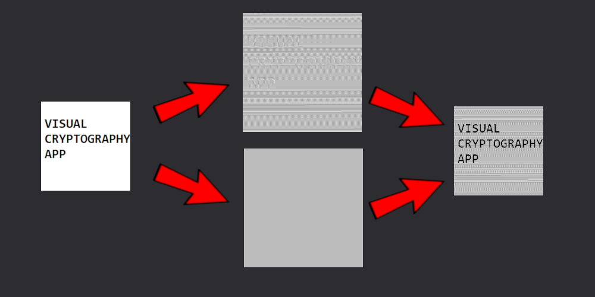
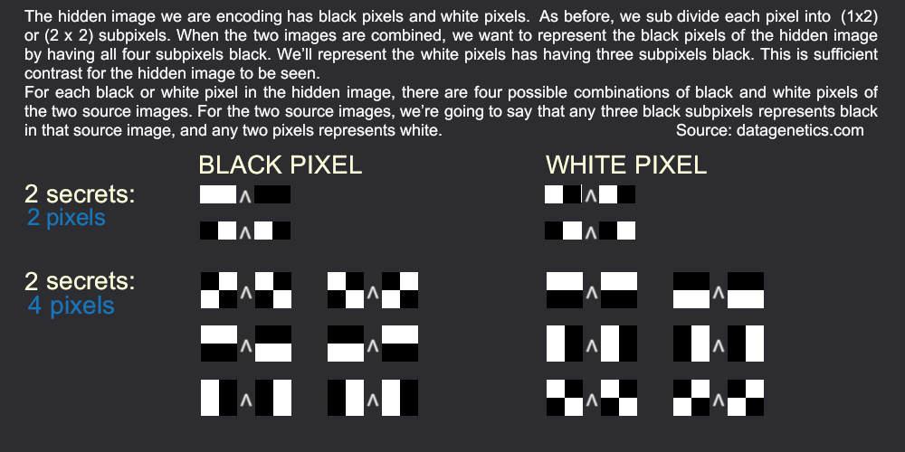

# VsualCryptographyApp
### Info
  
  

### Examples
#### 2 secrets - 2 pixels
Start image | Secret A | Secret B | Result
------------ | ------------- | ------------- | -------------
 |  |  | 

#### 2 secrets - 2 pixels
Start image | Secret A | Secret B | Result
------------ | ------------- | ------------- | -------------
 |  |  | 
